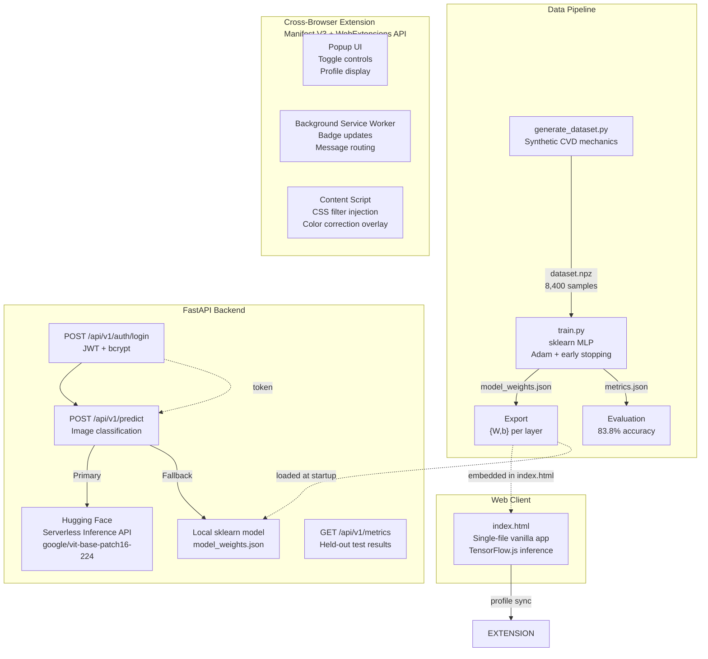

# VisionAdapt

> Adaptive computer vision platform — dynamic dataset synthesis, local ML training, FastAPI backend with JWT auth, Hugging Face API inference, and a cross-browser extension for real-time color correction.


---

## Problem

**300 million people** worldwide live with color vision deficiency (CVD). **83% of top competitive games ship zero CVD support** — players cannot distinguish enemies, pickups, health bars, or team markers from the background.

## Solution

VisionAdapt is an end-to-end adaptive computer vision platform:

1. **Synthesize** training data from documented CVD confusion-axis mechanics
2. **Train** a real ML classifier (scikit-learn) to predict deficiency type and severity
3. **Serve** predictions via a FastAPI backend with JWT authentication
4. **Classify** images using Hugging Face's free Inference API (with local fallback)
5. **Correct** colors in real time through a cross-browser extension (Chrome, Edge, Firefox, Opera)

---

## Architecture



---

## Repository Structure

```
visionadapt/
├── main.py                  # FastAPI backend (auth, predict, metrics)
├── auth.py                  # JWT + bcrypt authentication
├── models.py                # Pydantic request/response schemas
├── inference.py             # HF API client + local sklearn fallback
├── train.py                 # ML training pipeline (scikit-learn)
├── generate_dataset.py      # Synthetic dataset generator
├── generate_icons.py        # Extension icon generator
├── index.html               # Web client (single-file, vanilla JS)
├── model_weights.json       # Exported model weights (also in index.html)
├── metrics.json             # Held-out test set evaluation
├── dataset_meta.json        # Dataset metadata
├── model_card.md            # Model documentation
├── architecture.md          # System architecture (Mermaid diagrams)
├── extension/               # Cross-browser extension (Manifest V3)
│   ├── manifest.json
│   ├── popup.html
│   ├── popup.js
│   ├── background.js
│   ├── content.js
│   ├── overlay.css
│   └── icons/
├── seed_data.json           # Sample payloads for testing
├── requirements.txt         # Python dependencies
├── deploy.yml               # GitHub Pages CI/CD
├── PITCH_DECK.md            # 8-slide pitch deck content
├── DEMO_SCRIPT.md           # 2-minute demo video script
├── LICENSE                  # MIT License
└── README.md                # This file
```

---

## Tech Stack

| Layer | Technology | Purpose |
|-------|-----------|---------|
| **Backend** | Python, FastAPI, Uvicorn | REST API, auth, inference routing |
| **Auth** | python-jose, passlib, bcrypt | JWT tokens, password hashing |
| **ML Training** | scikit-learn, NumPy | Train CVD classifier + regressor |
| **Inference** | Hugging Face Serverless API | Image classification (ViT model) |
| **Inference Fallback** | Local sklearn model | When HF API is unavailable |
| **Web Client** | Vanilla HTML/CSS/JS, TensorFlow.js | Browser-side CVD assessment |
| **Extension** | Manifest V3, WebExtensions API | Chrome, Edge, Firefox, Opera |
| **CI/CD** | GitHub Actions | Auto-deploy to GitHub Pages |

---

## Quick Start

### Prerequisites
- Python 3.8+
- pip

### 1. Install Dependencies
```bash
pip install -r requirements.txt
```

### 2. Run the Backend
```bash
uvicorn main:app --reload --port 8000
# Visit http://localhost:8000/docs for Swagger UI
```

### 3. Run the Web Client
```bash
python3 -m http.server 8000 --directory .
# Or just open index.html directly in a browser
```

### 4. Load the Extension
```bash
# Chrome / Edge
# 1. Go to chrome://extensions (or edge://extensions)
# 2. Enable "Developer mode"
# 3. Click "Load unpacked"
# 4. Select the extension/ directory

# Firefox
# 1. Go to about:debugging#/runtime/this-firefox
# 2. Click "Load Temporary Add-on"
# 3. Select extension/manifest.json
```

### 5. (Optional) Set Hugging Face API Key
```bash
export HF_API_KEY="hf_your_free_api_key"
# Get one at https://huggingface.co/settings/tokens
```

---

## API Endpoints

| Method | Endpoint | Auth | Description |
|--------|----------|------|-------------|
| `POST` | `/api/v1/auth/register` | No | Create account |
| `POST` | `/api/v1/auth/login` | No | Get JWT token |
| `GET` | `/api/v1/auth/me` | Yes | Current user profile |
| `POST` | `/api/v1/predict` | Yes | Image classification (HF API + fallback) |
| `POST` | `/api/v1/predict/cvd` | Yes | Local CVD classifier (12-dim vector) |
| `GET` | `/api/v1/metrics` | No | Model evaluation metrics |
| `GET` | `/api/v1/model/info` | No | Local model metadata |
| `GET` | `/api/v1/health` | No | Health check |

### Test the API
```bash
# Register
curl -X POST http://localhost:8000/api/v1/auth/register \
  -H "Content-Type: application/json" \
  -d '{"email":"test@example.com","password":"test123"}'

# Login
curl -X POST http://localhost:8000/api/v1/auth/login \
  -d "username=test@example.com&password=test123"

# Predict (use token from login)
curl -X POST http://localhost:8000/api/v1/predict \
  -H "Authorization: Bearer <token>" \
  -H "Content-Type: application/json" \
  -d '{"image_url":"https://example.com/image.jpg"}'
```

---

## Retraining the Model

```bash
python3 generate_dataset.py    # Creates dataset.npz
python3 train.py               # Trains + evaluates + exports weights
# Re-embed model_weights.json into index.html (CVD_MODEL_WEIGHTS constant)
```

---

## Model Performance

| Metric | Value |
|--------|-------|
| Axis classifier accuracy | **83.8%** |
| Macro F1 | **0.79** |
| Severity MAE | **16.7 points** |
| Training samples | **6,000** (balanced) |
| Test samples | **1,200** (held-out) |

---

## Cross-Browser Extension

| Browser | Support | Method |
|---------|---------|--------|
| Chrome  | Full | Manifest V3 + service worker |
| Edge    | Full | Same as Chrome (Chromium-based) |
| Firefox | Full | WebExtensions API (Manifest V3 supported) |
| Opera   | Full | Same as Chrome (Chromium-based) |
| Safari  | Partial | Would need native Safari conversion (roadmap) |

The extension uses **CSS filter injection** with scientifically-grounded color correction matrices (Machado, Oliveira & Fitzpatrick 2009) to remap colors in real time. Profile settings sync from the VisionAdapt dashboard via `chrome.storage.local`.

---

## Testing

### Use seed_data.json
```bash
# The seed_data.json file contains 5 pre-built payloads for different CVD types.
# Load any payload's feature_vector into the /api/v1/predict/cvd endpoint.
```

### Verify everything works
```bash
# Backend health check
curl http://localhost:8000/api/v1/health

# Model metrics
curl http://localhost:8000/api/v1/metrics
```

---

## License

MIT License — see [LICENSE](LICENSE) for details.

---

**Built for accessible competitive gaming.** Color vision should never determine competitive outcome.
